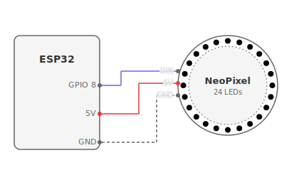

# NeoPixel

Cycles through animation patterns on a WS2812 (NeoPixel) LED ring/strip: rainbow, comet, breathe, sparkle, color wipe.

```sh
npm create mikrojs my-neopixel --template neopixel
```

## Hardware

- WS2812/NeoPixel strip (e.g. https://www.adafruit.com/product/1586) on GPIO 8
- Configured for 24 LEDs at 20% brightness. Edit `PIN`, `NUM_LEDS`, `BRIGHTNESS` in `main.ts` to change.

## Hardware diagram



## Run

```sh
npx mikro dev       # develop on connected device
npx mikro deploy    # build and deploy to device
```
